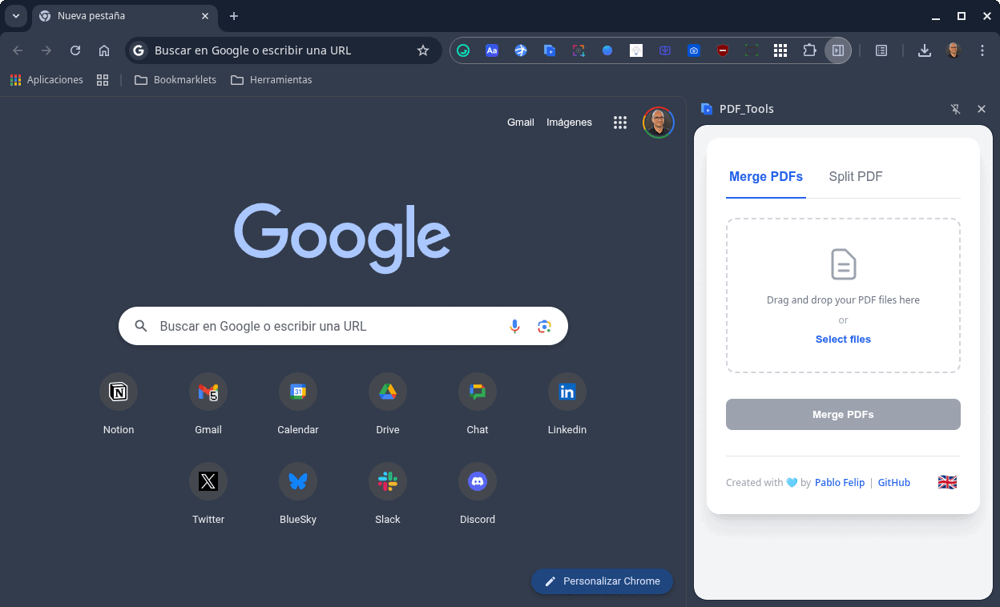

[🇪🇸 Versión en español](./README.md) | [🇬🇧 English version](./README-en.md)

# PDF_Tools

<p align="center">
  
</p>

**PDF_Tools** és una extensió lleugera i potent per a Google Chrome que integra eines de manipulació d'arxius PDF directament al teu navegador a través d'un modern panell lateral. Uneix i divideix documents PDF amb facilitat, sense necessitat d'instal·lar programari pesat ni dependre de serveis en línia.

Aquesta extensió neix de la necessitat de tenir a mà eines ràpides i eficients per a les tasques més comunes amb arxius PDF. En lloc d'obrir aplicacions d'escriptori o pujar arxius sensibles al web, PDF_Tools processa tot localment al teu navegador, garantint velocitat i privacitat.

## ✨ Característiques Principals

<p align="center">
  
</p>

* **Panell lateral modern**: Accedeix a totes les eines des d'un còmode panell lateral (`Side Panel API`) sense interrompre la teva navegació.
* **Unir PDF**: Combina múltiples arxius PDF en un únic document.
    * **Arrossegar i deixar anar**: Afegeix arxius fàcilment arrossegant-los a la interfície.
    * **Reordenació visual**: Canvia l'ordre dels arxius abans d'unir-los simplement arrossegant-los a la llista.
* **Dividir PDF**: Extreu pàgines o rangs d'un PDF.
    * **Extracció flexible**: Defineix rangs (`1-5, 8, 10-`) o extreu pàgines individuals.
    * **Divisió completa**: Genera un PDF per cada pàgina del document original amb un sol clic.
* **Compressió en ZIP**: Descarrega tots els arxius generats en la divisió dins d'un únic arxiu `.zip` per a més comoditat.
* **Multi-idioma**: Interfície disponible en anglès, espanyol i català, amb un selector per canviar d'idioma manualment o usar el del navegador.
* **Processament local**: Tots els arxius es processen a la teva màquina. Cap document surt del teu navegador, garantint el 100% de privacitat.

## ⚙️ Descripció Tècnica

PDF_Tools està construïda amb tecnologies web estàndard i segueix les millors pràctiques per al desenvolupament d'extensions de Chrome.

* **Manifest V3**: L'extensió utilitza l'última versió del manifest de Chrome, garantint major seguretat, rendiment i compatibilitat a futur.
* **JavaScript (vanilla JS)**: Tota la lògica de l'aplicació està escrita en JavaScript pur, sense dependències de frameworks, el que assegura un rendiment òptim i una mida de paquet reduïda.
* **API de panell lateral (`chrome.sidePanel`)**: S'utilitza l'API nativa de Chrome per mostrar la interfície en un panell lateral, oferint una experiència d'usuari integrada.
* **API d'internacionalització (`chrome.i18n`)**: El suport multi-idioma es gestiona a través de l'API `i18n` de Chrome, permetent una localització eficient.
* **API d'emmagatzematge (`chrome.storage`)**: La preferència d'idioma de l'usuari es desa localment usant `chrome.storage.local`.

## 🚀 Instal·lació

### Opció 1: Des de la Chrome Web Store (recomanat)

1.  Visita la [pàgina de PDF_Tools](https://chromewebstore.google.com/detail/amfbkjdnaalliclaenmafeohionnkmoa) a la Chrome Web Store.
2.  Fes clic a "Afegeix a Chrome".
3.  Llest! Ja pots usar l'extensió.

### Opció 2: Des del codi font (per a desenvolupadors i administradors TIC)

1.  Descarrega i descomprimeix o clona aquest repositori a la teva màquina local:
    ```bash
    git clone https://github.com/pfelipm/pdf-tools
    ```
2.  Obre Google Chrome i ves a la pàgina d'extensions: `chrome://extensions/`.
3.  Activa el **"Mode de desenvolupador"** a la cantonada superior dreta.
4.  Fes clic al botó **"Carrega descomprimida"**.
5.  Selecciona la carpeta del repositori que acabes de descarregar o clonar. L'extensió s'instal·larà localment.
6. Llest! La icona de l'extensió apareixerà a la teva barra d'extensions, et suggereixo que la fixis a ella per a usar-la amb més comoditat.

Aquesta opció pot facilitar el desplegament de l'extensió en una aula en la qual els ordinadors estiguin configurats per a navegar de manera predeterminada en mode d'incògnit. En aquest cas, després d'instal·lar-la al navegador de cada equip, marca l'opció **"Permet en incògnit"** en els ajustos de l'extensió perquè romangui activa en aquest mode.

## 💙 Crèdits

Aquest projecte ha estat creat i és mantingut per **[Pablo Felip](https://www.linkedin.com/in/pfelipm/)**.

Aquest projecte no seria possible sense l'excel·lent treball de la comunitat de codi obert. Les següents biblioteques s'utilitzen en aquesta extensió:

* **[pdf-lib.js](https://github.com/Hopding/pdf-lib)**: Per a la creació i manipulació de documents PDF en JavaScript.
* **[Sortable.js](https://github.com/SortableJS/Sortable)**: Per a la reordenació mitjançant arrossegar i deixar anar a la llista d'arxius.
* **[JSZip](https://github.com/Stuk/jszip)**: Per a la creació d'arxius `.zip` al navegador.

## ✊ Llicència

Aquest projecte es distribueix sota els termes de l'arxiu [LICENSE](/LICENSE).

## 🦊 Versió per a Firefox

[Juan José de Haro](https://bilateria.org/) ha tingut la gentilesa de preparar una versió de PDF_Tools per a Firefox. La pots trobar al seu propi [repositori GitHub](https://github.com/jjdeharo/pdf-tools-for-firefox).

Aquesta és la força del codi obert!